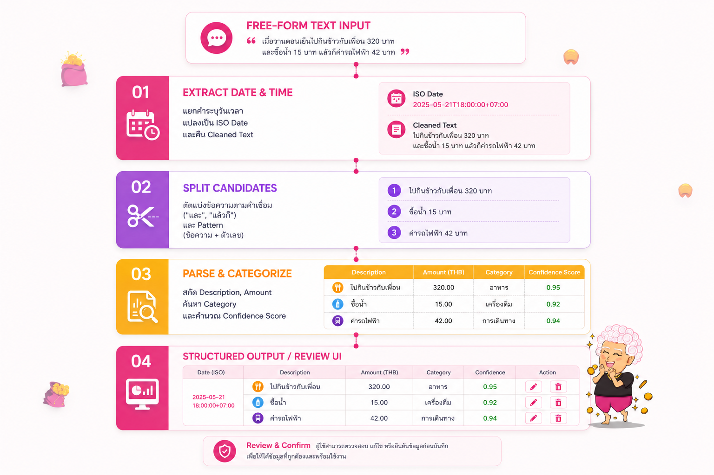
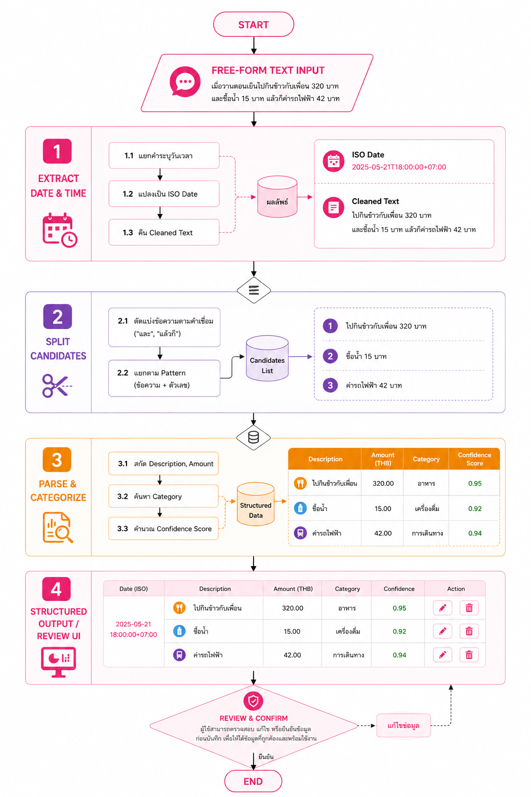
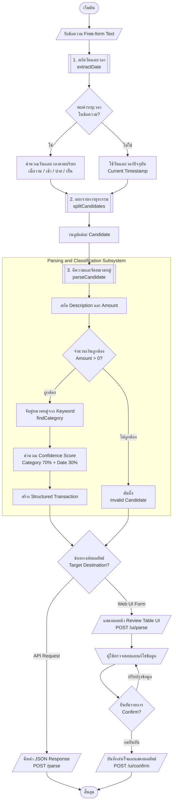
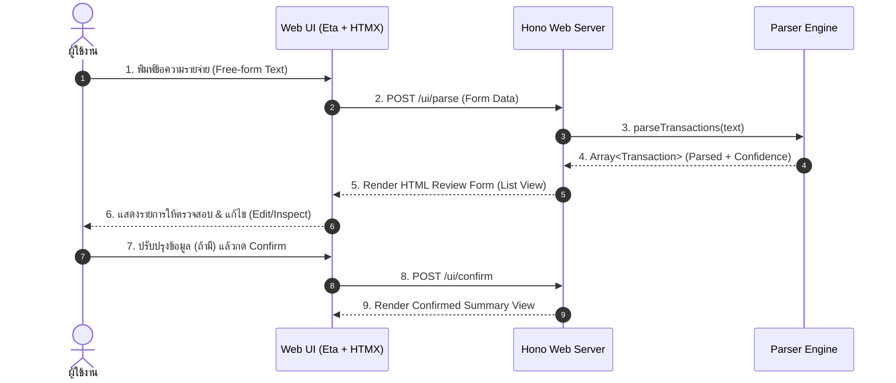
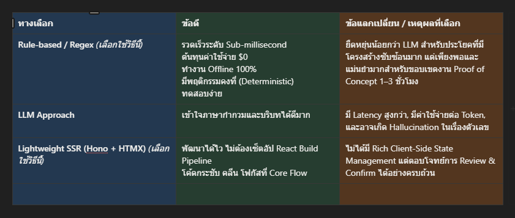
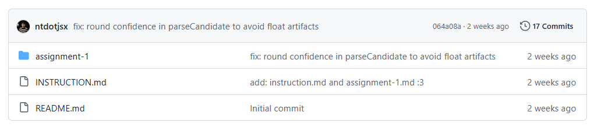

# Assignment 1 — Text -> Transaction Flow (Parnuan Take-Home)

ระบบแปลงข้อความรายจ่ายภาษาไทย (Free-form Text) ให้ออกมาเป็นรายการธุรกรรมการเงินที่มีโครงสร้าง (Structured Transactions) พร้อมหน้าจอตรวจสอบ แก้ไข และยืนยันข้อมูลก่อนบันทึกจริง

---

## สารบัญ (Table of Contents)

- [Tech Stack และเหตุผลในการเลือกใช้](#tech-stack-และเหตุผลในการเลือกใช้)
- [1. Reverse-Engineered Behavior (พฤติกรรมที่อนุมานจากโจทย์)](#1-reverse-engineered-behavior-พฤติกรรมที่อนุมานจากโจทย์)
- [2. Assumptions (สมมติฐานที่ตั้งไว้)](#2-assumptions-สมมติฐานที่ตั้งไว้)
- [3. Technical Design (การออกแบบระบบ)](#3-technical-design-การออกแบบระบบ)
  - [3.1 Pipeline Architecture (แผนภาพการประมวลผล)](#31-pipeline-architecture-แผนภาพการประมวลผล)
  - [3.2 User Interaction Flow (ลำดับการทำงานของระบบ)](#32-user-interaction-flow-ลำดับการทำงานของระบบ)
- [4. Parsing Strategy (กลยุทธ์การตีความข้อความ)](#4-parsing-strategy-กลยุทธ์การตีความข้อความ)
- [5. Data Model (โครงสร้างข้อมูล)](#5-data-model-โครงสร้างข้อมูล)
- [6. Trade-offs (การชั่งน้ำหนักและการตัดสินใจ)](#6-trade-offs-การชั่งน้ำหนักและการตัดสินใจ)
- [7. Required Demo Cases (กรณีทดสอบหลัก)](#7-required-demo-cases-กรณีทดสอบหลัก)
- [8. Edge Cases Considered (กรณีขอบเขตที่คำนึงถึง)](#8-edge-cases-considered-กรณีขอบเขตที่คำนึงถึง)
- [9. Known Limitations (ข้อจำกัดและกรณีที่อาจผิดพลาด)](#9-known-limitations-ข้อจำกัดและกรณีที่อาจผิดพลาด)
- [10. What I Would Improve Next (สิ่งที่อยากต่อยอดหากมีเวลาเพิ่ม)](#10-what-i-would-improve-next-สิ่งที่อยากต่อยอดหากมีเวลาเพิ่ม)
- [11. Setup & Running Instructions](#11-setup--running-instructions)
- [12. Time Spent (เวลาที่ใช้พัฒนา)](#12-time-spent-เวลาที่ใช้พัฒนา)

---

## Tech Stack และเหตุผลในการเลือกใช้

เพื่อให้งานส่งมอบได้ตรงจุด โฟกัสที่ **Core Flow** ของระบบ ไม่บานปลาย และ **ไม่ Over-engineering** จึงเลือกใช้ Stack ที่เรียบง่ายแต่ทรงพลัง:

- **Runtime:** [Bun](https://bun.sh/) — เร็ว ติดตั้งง่าย มี test runner และ typescript support ในตัวโดยไม่ต้อง config build tools
- **Language:** TypeScript — มี Type safety ชัดเจน ช่วยลดข้อผิดพลาดใน Data model และ Parser pipeline
- **Web Server / API:** [Hono](https://hono.dev/) — Web framework ขนาดเล็ก เร็ว และเขียน Route ง่าย ทั้งสำหรับ REST API และ UI endpoints
- **Template & UI Interaction:** [Eta](https://eta.js.org/) + [HTMX](https://htmx.org/) + [Tailwind CSS](https://tailwindcss.com/) — ทำ Server-Side Rendering (SSR) และ Dynamic UI ได้โดยไม่ต้องสร้าง React/Vue SPA ให้ซับซ้อน
- **Validation & Test Suite:** [Vitest](https://vitest.dev/) / Bun Test — เขียน Unit Test ครอบคลุมทั้ง Core Parser, Date Extractor และ Category Matcher (40 tests passing)

---

## 1. Reverse-Engineered Behavior (พฤติกรรมที่อนุมานจากโจทย์)

จากการวิเคราะห์โจทย์และ Product Context ของ Parnuan สรุปพฤติกรรมหลักของระบบได้ดังนี้:

1. **One Message -> Multiple Transactions:** ผู้ใช้ไม่ได้ส่งแค่รายการเดียวเสมอไป มักพิมพ์หลายรายการในข้อความเดียว เช่น มีคำเชื่อม *"และ"*, *"แล้วก็"* หรือพิมพ์เว้นวรรคต่อเนื่อง
2. **Implicit / Explicit Date & Time Reference:** วันที่และเวลาอาจถูกระบุไว้ในเนื้อหา (เช่น *"เมื่อวาน"*, *"เมื่อวานตอน 5 โมงครึ่ง"*) ซึ่งระบบต้องดึงออกมาคำนวณเป็น Timestamp จริง และนำไปผูกกับทุก Transaction ในข้อความนั้น
3. **Reviewable Before Confirmation (Human-in-the-loop):** ภาษาธรรมชาติของมนุษย์มีความกำกวมสูง ระบบต้องส่งผลลัพธ์ที่สกัดได้กลับมาให้ผู้ใช้ **ตรวจทาน (Inspect)** และ **แก้ไข (Edit)** ชื่อรายการ, จำนวนเงิน, หรือหมวดหมู่ ก่อนกดยืนยันบันทึกจริงเสมอ

---

## 2. Assumptions (สมมติฐานที่ตั้งไว้)

- **ความสมบูรณ์ของรายการ:** รายการที่จะถือว่าเป็น Transaction ที่ถูกต้อง ต้องมีทั้ง **ชื่อรายการ (Description)** และ **จำนวนเงินที่มากกว่าศูนย์ (Amount > 0)** หากข้อความส่วนใดไม่มีจำนวนเงิน ระบบจะคัดทิ้ง
- **กรณีไม่ระบุวันที่/เวลา:** หากไม่มีคำบอกเวลาในข้อความ ระบบจะใช้วันที่และเวลาปัจจุบัน (`Current Date/Time`) เป็นค่าเริ่มต้น พร้อมแนบ Warning
- **กรณีหมวดหมู่ไม่ชัดเจน:** หากชื่อรายการไม่ตรงกับคีย์เวิร์ดใดๆ จะจัดเข้าหมวดหมู่ `other` (อื่นๆ) พร้อมให้ Confidence Score ต่ำ เพื่อให้ผู้ใช้สังเกตเห็นได้ง่ายในหน้า Review
- **ความกำกวมของเวลาแบบไทย:** คำว่า *"5 โมง"* โดยไม่มีคำระบุช่วงเวลา (เช้า/เย็น) มีความกำกวม ระบบจะตั้งสมมติฐานเป็นช่วงบ่าย/เย็น (17:00) ซึ่งเป็นช่วงที่คนนิยมบันทึกรายจ่าย พร้อมลดค่า Confidence และแนบ Warning แจ้งเตือน

---

## 3. Technical Design (การออกแบบระบบ)

### 3.1 Pipeline Architecture (แผนภาพการประมวลผล)

ระบบทำงานเป็น Pipeline ผ่าน 3 โมดูลหลัก:






### 3.2 User Interaction Flow (ลำดับการทำงานของระบบ)



---

## 4. Parsing Strategy (กลยุทธ์การตีความข้อความ)

เลือกใช้แนวทาง **Rule-based & Regex Matching** ผสานกับ **Keyword-based Heuristics**:

- **Date Extraction (`src/parser/date.ts`):** ใช้ Regex ตรวจจับคำระบุวันเวลา เช่น `เมื่อวานตอน 5 โมงครึ่ง` แล้วคำนวณ Time offset ตามช่วงเวลา (`เช้า`, `บ่าย`, `เย็น`, `ทุ่ม`, `ตี`)
- **Candidate Splitting (`src/parser/candidate.ts`):** ปรับ Normalize คำเชื่อมภาษาไทย (`และ`, `และก็`, `แล้วก็`) ให้เป็น Delimiter จากนั้นใช้ Regex วนลูปจับกลุ่มข้อความและตัวเลข
- **Category Classification (`src/utils/index.ts`):** จับคู่คำใน Description กับพจนานุกรมหมวดหมู่ (`food`, `shopping`, `transport`, `other`) โดยเลือกหมวดที่มีคีย์เวิร์ดตรงมากที่สุด
- **Confidence Scoring:** คำนวณคะแนนความมั่นใจจาก:
  $$\text{Confidence} = (\text{Category Confidence} \times 0.7) + (\text{Date Confidence} \times 0.3)$$
  ให้น้ำหนักกับหมวดหมู่มากกว่า เนื่องจากมีผลต่อความถูกต้องในการจัดประเภทรายจ่าย

---

## 5. Data Model (โครงสร้างข้อมูล)

```typescript
export type Category = {
  id: 'food' | 'shopping' | 'transport' | 'other'
  title: string
}

export type Transaction = {
  id: string              // Unique UUID
  description: string     // ชื่อรายการ เช่น "ข้าวมันไก่"
  amount: number          // จำนวนเงิน เช่น 50
  category: Category      // หมวดหมู่
  date: string            // ISO 8601 Timestamp เช่น "2026-08-28T10:30:00.000Z"
  confidence: number      // ค่าความมั่นใจ 0.0 - 1.0
  warning?: string[]      // ข้อความแจ้งเตือนความกำกวม (ถ้ามี)
}
```

---

## 6. Trade-offs (การชั่งน้ำหนักและการตัดสินใจ)

https://app.notion.com/p/Trade-offs-3cbd5ca94d8280538e62d655cbce98e7?source=copy_link



| ทางเลือก | ข้อดี | ข้อแลกเปลี่ยน / เหตุผลที่เลือก |
|---|---|---|
| **Rule-based / Regex** *(เลือกใช้วิธีนี้)* | - รวดเร็วระดับ Sub-millisecond<br>- ต้นทุนค่าใช้จ่าย $0<br>- ทำงาน Offline 100%<br>- มีพฤติกรรมคงที่ (Deterministic) ทดสอบง่าย | ยืดหยุ่นน้อยกว่า LLM สำหรับประโยคที่มีโครงสร้างซับซ้อนมาก แต่เพียงพอและแม่นยำมากสำหรับขอบเขตงาน Proof of Concept 1–3 ชั่วโมง |
| **LLM Approach** | - เข้าใจภาษากำกวมและบริบทได้ดีมาก | มี Latency สูงกว่า, มีค่าใช้จ่ายต่อ Token, และอาจเกิด Hallucination ในเรื่องตัวเลข |
| **Lightweight SSR (Hono + HTMX)** *(เลือกใช้วิธีนี้)* | - พัฒนาได้ไว ไม่ต้องเซ็ตอัป React Build Pipeline<br>- โค้ดกระชับ คลีน โฟกัสที่ Core Flow | ไม่ได้มี Rich Client-Side State Management แต่ตอบโจทย์การ Review & Confirm ได้อย่างครบถ้วน |

---

## 7. Required Demo Cases (กรณีทดสอบหลัก)

ระบบผ่านการทดสอบครอบคลุมทั้ง 3 Demo Cases ที่กำหนด:

### 1. Single Transaction
- **Input:** `ข้าวมันไก่ 50`
- **Output:** 1 รายการ (`ข้าวมันไก่`, ฿50.00, หมวดหมู่อาหาร)

### 2. Multiple Transactions
- **Input:** `ข้าวมันไก่ 50 น้ำเปล่า 7 แล้วก็ช้อปปิ้ง 500`
- **Output:** 3 รายการ (`ข้าวมันไก่` ฿50.00, `น้ำเปล่า` ฿7.00, `ช้อปปิ้ง` ฿500.00)

### 3. Message with Time Reference
- **Input:** `เมื่อวานตอน 5 โมงครึ่ง ข้าวมันไก่ 50`
- **Output:** 1 รายการ (`ข้าวมันไก่`, ฿50.00, วันที่ถูกย้อนกลับไป 1 วัน ณ เวลา 17:30 น.)

---

## 8. Edge Cases Considered (กรณีขอบเขตที่คำนึงถึง)

1. **คำเชื่อมภาษาไทยที่หลากหลาย:** รองรับ `และ`, `และก็`, `แล้วก็` หรือการเว้นวรรค
2. **จำนวนเงินทศนิยม:** รองรับตัวเลขทศนิยม เช่น `กาแฟ 65.50`
3. **ตัวเลขที่เป็นส่วนหนึ่งของชื่อสินค้า:** เช่น `lm แดง 70` หรือ `เป๊ปซี่ 1.5 ลิตร 35` (โดยระบบจะจับตัวเลขตัวท้ายสุดเป็นจำนวนเงิน)
4. **ข้อความที่ไม่มีจำนวนเงิน:** เช่น `วันนี้อากาศดีมาก` ระบบจะคืนผลลัพธ์เป็นอาเรย์ว่าง `[]` และหน้าจอจะแสดงคำแนะนำให้ผู้ใช้ระบุจำนวนเงิน
5. **ตัวเลขติดลบหรือเท่ากับ 0:** กรองทิ้งเพื่อป้องกันข้อมูลผิดพลาด

---

## 9. Known Limitations (ข้อจำกัดและกรณีที่อาจผิดพลาด)

1. **ข้อความที่ไม่มีการเว้นวรรคระหว่างชื่อและตัวเลข:** ภาษาไทยไม่มีช่องว่างระหว่างคำ เช่น `ข้าวมันไก่50` ระบบ Rule-based ปัจจุบันต้องการช่องว่างเพื่อแยกคำ
2. **คำบอกจำนวน/หน่วยนับ:** เช่น `ข้าว 2 จาน 100` ระบบอาจมอง `2 จาน` เป็นส่วนหนึ่งของชื่อรายการ
3. **การบอกเวลาที่ซับซ้อนหลายระดับ:** เช่น *"เมื่อวานตอนเย็นกินข้าว 50 แล้ววันนี้เช้าซื้อกาแฟ 40"* ระบบปัจจุบันจะดึง Time reference แรกไปใช้กับทุกรายการในข้อความนั้น

---

## 10. What I Would Improve Next (สิ่งที่อยากต่อยอดหากมีเวลาเพิ่ม)

1. **Hybrid Parsing Approach:** ใช้ Rule-based เป็นด่านแรกเพื่อความเร็ว ($0 cost) และส่งเฉพาะข้อความที่ได้ Confidence ต่ำเข้า LLM (เช่น Gemini Flash) เพื่อ Disambiguate
2. **Thai Word Segmentation:** นำ Lightweight Thai Tokenizer หรือ `Intl.Segmenter` มาช่วยตัดคำกรณีผู้ใช้พิมพ์ติดกัน
3. **User Feedback & Memory Learning (Assignment 2):** จดจำพฤติกรรมการแก้ไขของผู้ใช้ (เช่น ผู้ใช้แก้ "เป๊ปซี่" จากหมวดหมู่อื่นๆ เป็น "อาหาร") เพื่อนำมาปรับปรุง Keyword Matching ในครั้งถัดไปโดยอัตโนมัติ

---

## 11. Setup & Running Instructions

### ข้อกำหนดเบื้องต้น
- ติดตั้ง [Bun](https://bun.sh/) (เวอร์ชัน 1.0 ขึ้นไป)

### ขั้นตอนการรัน

```bash
# 1. ติดตั้ง Dependencies
bun install

# 2. รัน Unit Tests ทั้งหมด
bun test

# 3. รัน Development Server
bun run dev
```

เปิดเว็บเบราว์เซอร์ไปที่: **`http://localhost:3000`**

### API Endpoints

- **`POST /parse`** — ส่ง JSON `{ "text": "ข้าวมันไก่ 50" }` เพื่อรับ Structured JSON
- **`POST /ui/parse`** — Endpoint สำหรับ HTMX ส่ง Form Data เพื่อ Render หน้า Review
- **`POST /ui/confirm`** — Endpoint สำหรับยืนยันการบันทึกรายการ

---

## 12. Time Spent (เวลาที่ใช้พัฒนา)

- **การทำความเข้าใจโจทย์ & Reverse Engineering:** ~30 นาที
- **ออกแบบ Data Model & พัฒนา Parser Core Logic:** ~1 ชั่วโมง
- **สร้าง UI Review Flow (Hono + Eta + HTMX + Tailwind):** ~45 นาที
- **เขียน Unit Tests & Refactor Code:** ~10 นาที AI
- **เขียนเอกสาร README:** ~30 นาที
- **รวมเวลาทั้งหมด:** ประมาณ **3 ชั่วโมง**

แต่ผมติดปัญหาเพราะว่าต้องทำ APP โครงการจบของผมด้วยก็เลยต้องทุ่มเวลาไป ทำฝั่งนั้นก่อน แต่ผมมีหลักฐานการทำ Submission นี้ เพราะผมใช้ WakaTime ในการดูว่าโปรเจคไหนผมใช้เวลาไปเท่าไหร่ และใช้ AI หรืออะไรบ้าง แต่มันก็อาจจะ Total hrs. ไปเยอะหน่อยเพราะผมชอบเปิด code และ lock screen ไว้ก่อนออกไปผ่อนคลายตัวเอง

https://wakatime.com/@b5617e76-29cb-4464-8898-c452637c23bd/projects/usaecwkszz?start=2026-08-23&end=2026-08-29

ผมใช้ AI เป็น Accelerator ในการ Scaffold Test Cases และ Draft UI Template จากนั้นนำมา Review, Refactor Logic และ Validate ความถูกต้องทั้งหมดด้วยตัวเอง

