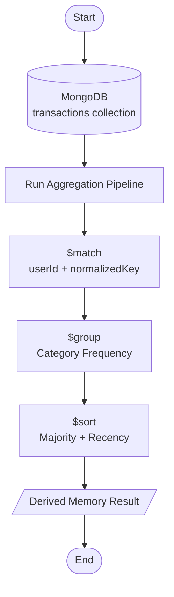
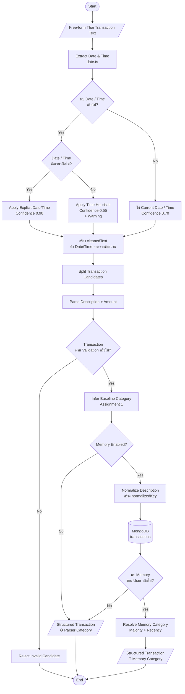
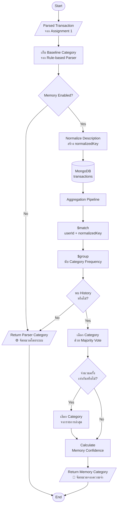
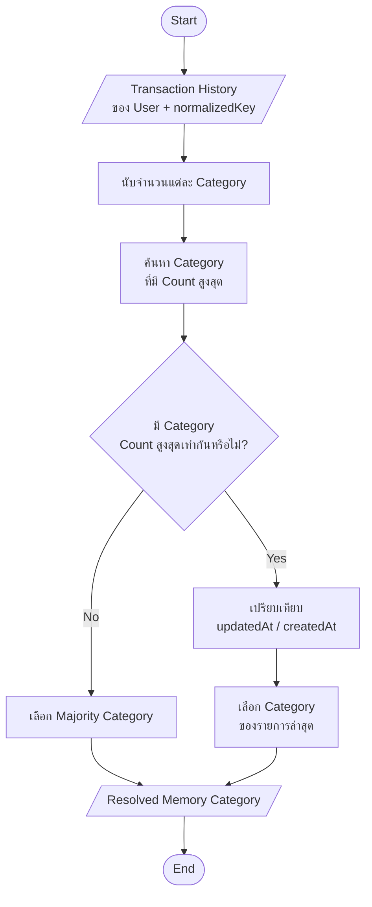
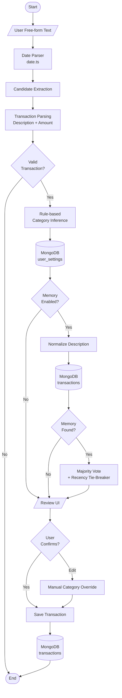

# Assignment 2 — Parnuan Memory Engine (Take-Home Submission)

ระบบ Memory Layer สำหรับจดจำพฤติกรรมและจัดหมวดหมู่รายจ่ายอัตโนมัติตามประวัติการใช้งานจริงของผู้ใช้แต่ละบุคคล (Personalized Expense Memory Engine) สร้างขึ้นครอบทับ Parser จาก Assignment 1

---

## สารบัญ (Table of Contents)

1. [Reverse-Engineered Behavior (พฤติกรรมที่วิเคราะห์ได้จากภาพโจทย์)](#1-reverse-engineered-behavior)
2. [Assumptions (สมมติฐานและการออกแบบ)](#2-assumptions)
3. [Memory Data Model (โครงสร้างข้อมูลความจำ)](#3-memory-data-model)
4. [Matching Strategy (กลยุทธ์การจับคู่ความจำ)](#4-matching-strategy)
   - [Integration with Assignment 1 Parser & `date.ts`](#41-integration-with-assignment-1-parser--datets)
   - [Memory Resolution Flow](#42-memory-resolution-flow)
   - [Confidence Heuristic](#43-การคำนวณคะแนนความมั่นใจ-confidence-heuristic)
5. [Update & Sync Rules (กฎการซิงค์และอัปเดตความจำ)](#5-update--sync-rules)
6. [Trust & Transparency (ความโปร่งใสและการควบคุมของผู้ใช้)](#6-trust--transparency)
7. [Trade-offs (การประเมินข้อดีข้อเสียทางสถาปัตยกรรม)](#7-trade-offs)
8. [Edge Cases & 3 Realistic Failure Modes (กรณีขอบและข้อจำกัด)](#8-edge-cases--failure-modes)
9. [Future Improvements (แผนการพัฒนาต่อยอด)](#9-future-improvements)
10. [Setup Instructions & Time Spent (การติดตั้ง ทดสอบ และเวลาที่ใช้)](#10-setup--time-spent)

---

## 1. Reverse-Engineered Behavior

จากการวิเคราะห์พฤติกรรมของระบบจากภาพ Screenshots ในโจทย์ สรุปพฤติกรรมหลักได้ดังนี้:

* **Passive Learning from Transactions:** ระบบไม่ได้ให้ผู้ใช้มานั่งสอนกฎทีละข้อ (Explicit Rule Teaching) แต่เรียนรู้จากพฤติกรรมจริงในอดีตของผู้ใช้ผ่านทุกรายการที่กดยืนยันบันทึก (Confirmed Transactions)
* **Per-User Memory Isolation:** ความจำถูกแยกขาดออกจากกันตามรายผู้ใช้ (`userId`) พฤติกรรมของ "นัท" จะไม่ส่งผลต่อการจัดหมวดหมู่ของ "เติ้ล"
* **Real-time Synchronization on Edit:** เมื่อผู้ใช้แก้ไขหมวดหมู่ของรายการในอดีต (เช่น เปลี่ยน `ข้าวมันไก่` จาก `อาหาร` เป็น `ข้าวเช้า`) ความจำของระบบจะอัปเดตตามทันที และมีข้อความแจ้งเตือน "อัปเดตความจำแล้ว"
* **User Control (Settings Toggle):** มีสวิตช์เปิด/ปิด "จัดหมวดด้วยความจำ" แยกรายบุคคล เมื่อปิดใช้งาน (Memory OFF):
  - ระบบจะถอยกลับไปใช้ Parser เริ่มต้น โดยธุรกรรมยังคงถูกบันทึกลงฐานข้อมูลตามปกติ (Transaction Persistence)
  - รายการที่บันทึกขณะปิด Memory จะถูกบันทึกด้วย `memoryEligible: false` เพื่อไม่ให้นำไปเป็น Learning Signal ในอนาคต
  - เมื่อเปิดใช้งาน Memory กลับมา รายการที่เคยสร้างตอนปิดจะไม่ส่งผลต่อความจำ และระบบจะนำเฉพาะประวัติที่มีสิทธิ์ (Eligible History) กลับมาคำนวณตามเดิม

---

## 2. Assumptions

1. **Memory Keying & Normalization:** ระบบใช้ Normalized Description เป็นคีย์หลักในการค้นหาความจำ โดยตัดช่องว่างหัวท้าย แปลงตัวอักษรละตินเป็นตัวพิมพ์เล็ก และยุบช่องว่างซ้ำซ้อน (`  ข้าวมันไก่   พิเศษ  ` -> `ข้าวมันไก่ พิเศษ`)
2. **Dynamic Categories & Custom Naming:** ผู้ใช้แต่ละคนมีโครงสร้างหมวดหมู่ไม่เหมือนกัน (เช่น บางคนใช้ `อาหาร`, บางคนแยกเป็น `ข้าวเช้า`, `ข้าวเที่ยง`, `ข้าวเย็น` หรือสร้างหมวด `อาหารแมว`) ระบบจึงรองรับทั้ง Preset มาตรฐาน และ Custom Category ที่ผู้ใช้พิมพ์เอง
3. **Threshold for Override:** เมื่อมีประวัติที่ตรงกันอย่างน้อย 1 รายการ ระบบจะดึงความจำมาแสดงเป็นค่าเริ่มต้น พร้อมแสดงระดับความมั่นใจ (Confidence Score) และป้าย `[จัดหมวดจากความจำ]` ให้ผู้ใช้ตรวจสอบก่อนยืนยัน
4. **Scope of Edit:** การแก้ไขหมวดหมู่ของธุรกรรม 1 รายการ จะถูกบันทึกเป็นหลักฐานใหม่ในประวัติ และคำนวณน้ำหนักร่วมกับรายการอื่นในอดีตผ่าน Majority Voting & Recency Rule
5. **Assignment 1 as Baseline Parser:** Memory Layer ไม่ได้แทนที่ Parser จาก Assignment 1 แต่ทำหน้าที่เป็น personalization layer ที่ครอบอยู่ด้านบน หากไม่มี Memory ที่เหมาะสม ระบบจะ fallback ไปยัง category ที่ Parser เดิมคำนวณไว้
6. **Date/Time Parsing Happens Before Memory Matching:** `date.ts` จาก Assignment 1 จะสกัด Date/Time ออกจากข้อความก่อน Candidate และ Memory Matching เพื่อไม่ให้คำหรือเลขที่เป็นวันเวลาเข้าไปปะปนกับ `normalizedKey`
7. **Low-confidence Date Guess Does Not Directly Affect Memory Category:** Warning และ Confidence จาก `date.ts` ใช้อธิบาย uncertainty ของเวลา ขณะที่ Memory Confidence คำนวณจาก transaction history แยกกัน เพื่อไม่ให้ความไม่แน่นอนด้านเวลาเปลี่ยนความหมายของ confidence ด้าน category โดยไม่ตั้งใจ

---

## 3. Memory Data Model

### สถาปัตยกรรมแบบ Derived View vs Materialized Store

ระบบนี้เลือกใช้สถาปัตยกรรม **Dynamic Derived View บน MongoDB Aggregation Pipeline** โดย **ไม่มีการสร้างตาราง `memories` แยกต่างหาก**

```text
+-------------------------------------------------------------+
|                MongoDB: transactions collection             |
|   { userId, normalizedKey, categoryId, categoryTitle, ... } |
+-------------------------------------------------------------+
                              │
               (Dynamic Aggregation on Demand)
                              ▼
+-------------------------------------------------------------+
|                  Derived Memory Resolution                  |
|    $match -> $group (Majority Count) -> $sort (Recency)     |
+-------------------------------------------------------------+
```

ในรูปแบบ Flowchart:



### ความหมายของสัญลักษณ์ใน Flowchart

| Symbol | Flowchart Meaning | ใช้ในระบบ |
|---|---|---|
| `([ ... ])` | Terminator | Start / End |
| `[/ ... /]` | Input / Output | Input text / Result |
| `[ ... ]` | Process | Parse, Normalize, Aggregate |
| `{ ... }` | Decision | ตรวจเงื่อนไข |
| `[( ... )]` | Database / Data Store | MongoDB |

### เหตุผลทางวิศวกรรม:

* **Single Source of Truth:** เมื่อประวัติธุรกรรมถูกแก้ไขหรือลบ ความจำจะเปลี่ยนแปลงตามทันที การ Derive ความจำจากประวัติธุรกรรมโดยตรงช่วยป้องกันปัญหา Synchronization Drift ระหว่าง Store ความจำอิสระกับ Transaction Source of Truth
* **Zero Synchronization Lag:** ไม่ต้องเขียน Background Job หรือ Trigger คอยซิงค์ข้อมูลระหว่าง 2 ตาราง

### MongoDB Schemas:

#### Collection: `transactions`

```typescript
interface TransactionDocument {
  id: string;              // UUID ประจำรายการ
  userId: string;          // รหัสผู้ใช้งาน (เช่น user_nut, user_title)
  description: string;     // ข้อความรายการต้นฉบับ
  normalizedKey: string;   // ข้อความที่ทำ Normalization สำหรับจับคู่
  amount: number;          // จำนวนเงิน
  categoryId: string;      // รหัสหมวดหมู่ (เช่น food, breakfast, custom_cat)
  categoryTitle: string;   // ชื่อหมวดหมู่ภาษาไทย (เช่น ข้าวเช้า, ช้อปปิ้ง)
  date: string;            // วันที่ของธุรกรรม (ISO 8601 String)
  memoryEligible?: boolean;// มีสิทธิ์นำไปคำนวณความจำหรือไม่ (false เมื่อบันทึกตอน Memory OFF)
  memoryExcluded?: boolean;// ถูกสั่งลืมความจำหรือไม่ (true เมื่อผู้ใช้สั่ง Forget/Clear)
  createdAt: Date;         // เวลาที่บันทึกเข้าระบบ
  updatedAt: Date;         // เวลาที่แก้ไขล่าสุด
}
```

#### Collection: `user_settings`

```typescript
interface UserSettingsDocument {
  userId: string;          // รหัสผู้ใช้งาน
  memoryEnabled: boolean;  // สถานะเปิด/ปิดโหมดจัดหมวดด้วยความจำ
  updatedAt: Date;
}
```

#### Collection: `users`

```typescript
interface UserDocument {
  id: string;              // user_nut, user_title
  name: string;            // นัท, เติ้ลแฟนนัท
  avatar: string;          // URL รูปภาพโปรไฟล์
  createdAt: Date;
}
```

---

## 4. Matching Strategy

เมื่อมีข้อความรายจ่ายเข้ามา ระบบจะดำเนินการตามลำดับขั้น โดย Assignment 2 จะไม่ทำหน้าที่ parse ข้อความใหม่ทั้งหมด แต่ reuse Structured Transaction ที่ได้จาก Assignment 1 แล้วจึงใช้ Memory Layer เพื่อพิจารณาว่าควร override category หรือไม่

### 4.1 Integration with Assignment 1 Parser & `date.ts`

ใน Assignment 1 ผมเพิ่ม `date.ts` เพื่อแยก Date/Time Parsing ออกจาก Transaction Parser โดยเฉพาะ

เหตุผลคือ free-form transaction ภาษาไทยสามารถมีตัวเลขที่เป็นเวลาและจำนวนเงินอยู่ในข้อความเดียวกัน เช่น:

```text
เมื่อวาน 5 โมง 11 นาที ข้าวมันไก่ 60 บาท
```

ตัวเลขในข้อความมีคนละความหมาย:

```text
5   -> hour
11  -> minute
60  -> amount
```

หากนำข้อความทั้งหมดเข้า Transaction Parser หรือ Memory Matching โดยตรง อาจทำให้ตัวเลขของเวลาเข้าไปรบกวน Candidate Extraction หรือ Amount Parsing ได้

ดังนั้น Parser Pipeline จะเรียก `extractDate()` ก่อน:

```typescript
export interface ExtractDateResult {
    date: Date
    cleanedText: string
    confidence: number
    warning?: string
}
```

`date.ts` รองรับตัวอย่าง expression เช่น:

```text
วันนี้
เมื่อวาน
เมื่อวานซืน
3 วันก่อน
2 วันที่แล้ว

5 โมง 11
5 โมง 11 นาที

6 โมงเย็น
6 เย็นโมง 20 นาที

บ่าย 2 โมง 10 นาที

ตี 4
ตี 4 ครึ่ง

2 ทุ่ม
2 ทุ่ม 15 นาที

เที่ยง
เที่ยงครึ่ง
เที่ยงคืน
```

ตัวอย่าง:

```text
Input:
เมื่อวาน 2 ทุ่ม 15 นาที ข้าวมันไก่ 60
```

หลัง `extractDate()`:

```text
date:
Yesterday at 20:15

cleanedText:
ข้าวมันไก่ 60
```

จากนั้น `cleanedText` จึงถูกส่งไปยัง Candidate / Transaction Parser และท้ายที่สุดจึงเข้าสู่ Memory Layer

### Parser + Date + Memory Flow



Flow นี้แสดง Separation of Concerns ของระบบ:

```text
date.ts
   ↓
Candidate Parser
   ↓
Transaction Parser
   ↓
Baseline Category
   ↓
Memory Layer
```

Memory Layer จึงไม่จำเป็นต้องรู้วิธีตีความภาษา `ตี 4`, `2 ทุ่ม`, `เมื่อวาน` หรือ `5 โมง` โดยตรง เพราะ responsibility เหล่านี้อยู่ใน Assignment 1

---

### Date Ambiguity & Warning

กรณีเวลาที่ชัดเจน เช่น:

```text
2 ทุ่ม
บ่าย 2 โมง
ตี 4
```

`date.ts` สามารถใช้ explicit rule และให้ confidence สูงกว่า

แต่ถ้าเป็น:

```text
5 โมง
```

ข้อความไม่มี `เช้า`, `บ่าย`, `เย็น`, `ทุ่ม` หรือ `ตี`

Parser จึงใช้ heuristic และระบุว่าเป็น Guess:

```typescript
confidence: 0.55
```

พร้อม Warning เช่น:

```text
Interpreted "5 โมง" as 17:00 (guessed) —
no explicit เช้า/บ่าย/เย็น/ทุ่ม/ตี given,
so this is a guess. Please verify.
```

แนวคิดคือ **ระบบสามารถช่วยเดาได้ แต่ไม่ควรซ่อน uncertainty จากผู้ใช้**

สิ่งนี้สอดคล้องกับ Trust & Transparency ของ Memory Layer เช่นกัน เพราะทั้ง Date Parser และ Memory Engine จะบอกผู้ใช้ว่าค่าที่เห็นมาจาก:

```text
Parser
Memory
หรือ Heuristic Guess
```

แทนที่จะนำค่าทั้งหมดมาแสดงเหมือนมีความแน่นอนเท่ากัน

---

### 4.2 Memory Resolution Flow

หลัง Assignment 1 สร้าง Baseline Transaction แล้ว Memory Layer จึงทำงานดังนี้:



หลักการสำคัญคือ:

```text
Memory match
    ↓
ใช้ Personalized Category

No memory match
    ↓
Fallback Assignment 1 Parser
```

ทำให้ Memory Layer เป็น Enhancement แทนที่จะเป็น Dependency ที่ทำให้ Parser เดิมใช้งานไม่ได้

---

### 4.3 การคำนวณคะแนนความมั่นใจ (Confidence Heuristic)

* **ความถี่ 1 ครั้ง:** ความมั่นใจ 85% (`confidence = 0.85`)
* **ความถี่ 2 ครั้งขึ้นไปและเป็นเอกฉันท์ (Unanimous):** ความมั่นใจ 95% (`confidence = 0.95`)
* **มีประวัติขัดแย้งกัน (Conflicting History):** คำนวณแบบสัดส่วนตามสูตร `0.70 + (bestFrequency / totalFrequency) * 0.20` และจำกัดช่วงค่าไว้ที่ `[0.70, 0.90]`
  - เช่น อาหาร 2 ครั้ง, ข้าวเช้า 1 ครั้ง (total = 3, ratio = 2/3): `0.70 + (2/3) * 0.20 ≈ 0.83` (ไม่เป็น 0.95 เพื่อสะท้อนข้อขัดแย้งในอดีต)
  - เช่น อาหาร 1 ครั้ง, ข้าวเช้า 1 ครั้ง (total = 2, ratio = 0.5): `0.70 + 0.5 * 0.20 = 0.80`

Confidence ตรงนี้เป็น **Memory Confidence** และแยกจาก Date Confidence ของ `date.ts`

ตัวอย่าง:

```text
ข้าวมันไก่ 60 ตอน 5 โมง
```

อาจมี:

```text
Date confidence:
0.55
```

เพราะ `5 โมง` มี ambiguity

ในขณะที่:

```text
Memory confidence:
0.95
```

เพราะผู้ใช้เคยบันทึก `ข้าวมันไก่` เป็น `ข้าวเช้า` หลายครั้งอย่างสม่ำเสมอ

สองค่าจึงสะท้อนคนละเรื่องและไม่ควรถูกนำมารวมเป็น probability เดียวโดยไม่มีเหตุผล

---

## 5. Update & Sync Rules

### กฎการแก้ความขัดแย้ง (Conflict Resolution):

1. **Majority Rule:** หมวดหมู่ที่มีจำนวนครั้งการบันทึกมากที่สุดจะได้รับเลือกเป็นอันดับแรก
2. **Recency Tie-Breaker:** หากจำนวนครั้งเท่ากัน (เช่น บันทึก `อาหาร` 1 ครั้ง และ `ข้าวเช้า` 1 ครั้ง) ระบบจะเลือกหมวดหมู่ของรายการที่มี `updatedAt` / `createdAt` ใหม่ล่าสุด
3. **Non-destructive Forget & Reset:** การสั่งลืมคำเฉพาะหรือล้างความจำทั้งหมด จะไม่ลบเอกสารธุรกรรมจริงออกจาก MongoDB แต่จะตั้งค่า `memoryExcluded: true` บนเอกสารธุรกรรมที่เกี่ยวข้อง เพื่อให้ระบบ Memory มองข้ามข้อมูลเหล่านั้นในการคำนวณความจำ ขณะที่ประวัติธุรกรรม (Financial Transaction History) ของผู้ใช้ยังคงอยู่ครบถ้วน

Flow ของ Conflict Resolution:



เนื่องจากระบบใช้ Derived View จาก `transactions` โดยตรง การแก้ไขหรือลบรายการในอดีตไม่จำเป็นต้อง sync ไปยัง `memories` collection เพิ่มเติม

ตัวอย่าง:

```text
History เดิม:

ข้าวมันไก่ -> อาหาร
ข้าวมันไก่ -> อาหาร
ข้าวมันไก่ -> ข้าวเช้า
```

ผล:

```text
อาหาร
```

เพราะ Majority = 2

หากผู้ใช้แก้รายการหนึ่ง:

```text
ข้าวมันไก่ -> ข้าวเช้า
ข้าวมันไก่ -> อาหาร
ข้าวมันไก่ -> ข้าวเช้า
```

Aggregation ครั้งถัดไปจะได้:

```text
ข้าวเช้า
```

ทันที โดยไม่ต้อง update Memory Record แยกต่างหาก

---

## 6. Trust & Transparency

* **Inspectable Memory State:** ผู้ใช้สามารถดูรายการคำศัพท์ทั้งหมดที่ระบบเรียนรู้ได้ผ่าน Sidebar บนหน้าเว็บ หรือผ่าน API `GET /api/memory?userId=...` โดยแสดงทั้งจำนวนครั้งที่ใช้ และคะแนนความมั่นใจ
* **Non-destructive Memory Deletion & Resetting:** ผู้ใช้สามารถควบคุมข้อมูลความจำของตนเองได้เต็มรูปแบบโดยไม่สูญเสียประวัติการเงิน:
  * **ลืมเฉพาะคำ:** กดปุ่มถังขยะ `🗑️` ที่การ์ดคำศัพท์ หรือเรียก `DELETE /api/memory?userId=...&keyword=...` (ระบบจะยกเว้นคำนั้นจาก Memory โดยประวัติธุรกรรมยังคงอยู่)
  * **ล้างความจำทั้งหมด:** กดปุ่ม `ล้างทั้งหมด` หรือเรียก `POST /api/memory/clear` (ระบบจะรีเซ็ตความจำทั้งหมดโดยประวัติธุรกรรมยังคงอยู่ครบถ้วน)
* **Clear Attribution Badge:** ในหน้าตรวจสอบก่อนบันทึก ระบบจะแสดงป้าย `🧠 [จัดหมวดจากความจำ]` หรือ `⚙️ [จัดหมวดโดยระบบ]` ชัดเจน พร้อมเปอร์เซ็นต์ความมั่นใจ
* **Manual Override & Customization:** ผู้ใช้สามารถเปลี่ยนหมวดหมู่ผ่าน Dropdown หรือพิมพ์หมวดหมู่ใหม่ได้ทันทีก่อนกดยืนยัน

### Explainability Across Parser & Memory

นอกจาก Memory Attribution แล้ว Assignment 1 ยังคืน Warning จาก Date Parser ในกรณีที่ต้องตีความข้อมูลที่กำกวม

ดังนั้น UI สามารถบอกผู้ใช้ได้แยกกันว่า:

```text
🧠 Category:
ข้าวเช้า — จัดหมวดจากความจำ 95%

⚠️ Date:
17:00 — inferred from "5 โมง", please verify
```

การแยก attribution แบบนี้สำคัญ เพราะผู้ใช้อาจเชื่อถือ Category แต่ต้องการแก้ไข Date หรือในทางกลับกัน

---

## 7. Trade-offs

| การตัดสินใจ | สิ่งที่เลือก | ข้อดี | ข้อเสีย / ข้อจำกัดที่ยอมรับ |
|---|---|---|---|
| **Data Architecture** | Derived on Read (Aggregation) | ข้อมูล Consistent, แก้ไข/ลบแล้วซิงค์ทันที ป้องกัน Synchronization Drift | ต้องคำนวณ Query เมื่อเรียกใช้งาน (แก้ไขได้ด้วย Compound Index `{ userId: 1, normalizedKey: 1, memoryEligible: 1, memoryExcluded: 1 }`) |
| **Matching Engine** | Normalized Exact Match | แม่นยำสูง (High Precision), ไม่เดาสุ่มจนผิดพลาด, ทำงานเร็วมาก (< 5ms) | ไม่รองรับคำพ้องความหมายที่สะกดต่างกันสิ้นเชิง (Semantic Synonyms) |
| **Technology Stack** | Native MongoDB Driver + Bun | Native ESM, ปลอดภัยจาก ORM overhead, รองรับ Aggregation Pipeline ประสิทธิภาพสูง | ต้องจัดการ Polyfill สำหรับบาง Driver บน Runtime ใหม่ |
| **Parser Integration** | Memory Layer ครอบ Assignment 1 Parser | แยก Responsibility ชัดเจน และ fallback ได้เสมอ | มี metadata หลายประเภท เช่น Parser Confidence, Date Confidence และ Memory Confidence |
| **Date Parsing** | Deterministic Regex + Heuristic | Predictable, explainable และ unit test ได้ง่าย | ภาษาไทยมี ambiguity บางรูปแบบที่ต้อง Guess |
| **Ambiguous Time** | Guess + Warning + Lower Confidence | ระบบยังทำงานต่อได้โดยไม่ซ่อน uncertainty | ผู้ใช้ยังต้อง verify ในบางกรณี |

---

## 8. Edge Cases & Failure Modes

### Edge Cases ที่รองรับและผ่านการทดสอบ:

* **Cold Start:** ผู้ใช้ใหม่ที่ยังไม่มีประวัติ ระบบจะ Fallback กลับไปใช้ Parser เริ่มต้นอย่างราบรื่น
* **Multi-user Isolation:** ผู้ใช้ 2 คนใช้คำเดียวกันแต่เลือกคนละหมวดหมู่ ระบบแยกผลลัพธ์เด็ดขาด
* **Whitespace & Case Variations:** `  ข้าวมันไก่  ` และ `ข้าวมันไก่` หรือ `Grab` และ `grab` ถูก Normalize ให้เป็นคีย์เดียวกัน
* **Category Override in History:** การแก้ไขรายการในอดีตทำให้ความจำอนาคตเปลี่ยนตามทันที
* **Date Before Transaction Parsing:** Date/Time expression ถูกนำออกก่อน Candidate Parsing ทำให้ตัวเลขจากเวลาไม่ถูกเข้าใจเป็น Amount โดยไม่ตั้งใจ
* **Ambiguous Thai Time:** เช่น `5 โมง` ระบบลด Date Confidence และแสดง Warning แทนการแสดงผลเหมือนเป็นค่าที่แน่นอน
* **Explicit Thai Time:** เช่น `2 ทุ่ม`, `ตี 4`, `บ่าย 2 โมง` สามารถ resolve เป็น 24-hour time ได้โดยตรง

### 3 Realistic Failure Modes (ข้อจำกัดในปัจจุบัน):

1. **Semantic Synonyms without Lexical Overlap:** หากระบบเคยจำ `ข้าวมันไก่` -> `อาหาร` แต่ผู้ใช้พิมพ์ `ข้าวมันไก่ตอน` หรือ `ไก่ตอนพิเศษ` ตัว Matching แบบ Lexical จะถือว่าเป็นคนละคีย์และ Fallback ไปที่ Parser
2. **Context-Dependent Transactions:** คำเดียวกันในเวลาต่างกัน (เช่น `ข้าวมันไก่` ตอน 08:00 ควรเป็น `ข้าวเช้า` แต่ตอน 19:00 ควรเป็น `ข้าวเย็น`) ระบบปัจจุบันยังเลือกตาม Majority รวม ไม่ได้แยกเงื่อนไขตามช่วงเวลา
3. **Typo / Misspelling:** หากผู้ใช้พิมพ์ผิด เช่น `ข้าวมันไก่่` (มีวรรณยุกต์ซ้อน) จะไม่ตรงกับคีย์ `ข้าวมันไก่` เดิม

### Date Parser Limitation ที่เกี่ยวข้อง

แม้ `date.ts` จะช่วยให้ Assignment 1 รองรับ Date/Time ภาษาไทยได้มากขึ้น แต่ยังมีข้อจำกัด เช่น:

```text
เมื่อเช้า
เมื่อคืน
หัวค่ำ
สาย ๆ
บ่ายแก่ ๆ
ประมาณห้าโมง
```

expression เหล่านี้ยังต้องการ rule เพิ่มเติม หรือ representation แบบ time range แทน exact timestamp

ข้อจำกัดนี้ไม่ได้ทำให้ Memory Matching ผิดโดยตรง เนื่องจาก Memory ใน implementation ปัจจุบันใช้ `description / normalizedKey` เป็นหลัก แต่จะมีผลถ้าในอนาคตนำ Time-of-Day มาใช้เป็น Context ของ Memory

---

## 9. Future Improvements

หากมีเวลาพัฒนาเพิ่มเติมในอนาคต:

1. **Hybrid Lexical + Vector Embedding Search:** ใช้ Embedding โมเดลขนาดเล็ก (เช่น Sentence-Transformers) เพื่อจับคู่คำที่มีความหมายใกล้เคียงกัน (เช่น `มื้อเช้า` กับ `ข้าวเช้า`)
2. **Time-decay & Temporal Context Weighting:** เพิ่มค่าน้ำหนักตามช่วงเวลาของวัน (Time of Day) และลดน้ำหนักของประวัติที่เก่ามาก (Time Decay)
3. **N-gram Compound Extraction:** ตัดคำและดึงคำหลัก (Keywords) ออกจากประโยคยาวเพื่อจับคู่ความจำเฉพาะจุด

### 4. Context-aware Memory using `date.ts`

ปัจจุบัน `date.ts` และ Memory Engine แยก responsibility ออกจากกัน

ในอนาคตสามารถนำ Date/Time ที่ Parse ได้มาเป็น Context เพิ่มเติม เช่น:

```text
ข้าวมันไก่
08:00
```

อาจเรียนรู้ว่า:

```text
ข้าวมันไก่ + morning
→ ข้าวเช้า
```

ขณะที่:

```text
ข้าวมันไก่
19:00
```

อาจเรียนรู้ว่า:

```text
ข้าวมันไก่ + evening
→ ข้าวเย็น
```

แทนการใช้ `normalizedKey` เพียงอย่างเดียว

### 5. Better Thai Temporal Expressions

เพิ่ม Date Parser ให้รองรับ:

```text
เมื่อเช้า
เมื่อคืน
อาทิตย์ที่แล้ว
วันจันทร์ที่ผ่านมา
เมื่อสองชั่วโมงก่อน
ประมาณห้าโมง
```

รวมถึงการ representation เวลาแบบ range สำหรับคำที่ไม่มีเวลาชัดเจน เช่น:

```text
ตอนเช้า
หัวค่ำ
ช่วงบ่าย
```

แทนการบังคับทุก expression ให้กลายเป็น exact hour ทันที

### 6. Confidence Model Separation

หากระบบมี complexity เพิ่มขึ้น สามารถแยก confidence อย่างชัดเจนเป็น:

```typescript
interface TransactionConfidence {
    transaction: number
    category: number
    date: number
    memory?: number
}
```

เพื่อให้ UI สามารถอธิบาย uncertainty ของแต่ละ field แยกกัน

---

## 10. Setup Instructions & Time Spent

### สิ่งที่ต้องมีก่อนติดตั้ง (Prerequisites):

* [Bun](https://bun.sh) (v1.2+)
* [Docker](https://www.docker.com/) & Docker Compose (สำหรับรัน MongoDB และ Multi-service stack)

### วิธีที่ 1: รันแบบ Standalone ด้วย Bun (Local Development):

```bash
# 1. ติดตั้ง Dependencies
bun install

# 2. เริ่มต้นฐานข้อมูล MongoDB ผ่าน Docker Compose (จาก root directory)
docker compose up mongodb -d

# 3. รันระบบ Development Server
bun dev
```

เปิดเบราว์เซอร์ไปที่: **`http://localhost:3000`**

### วิธีที่ 2: รันผ่าน Docker Compose จาก Root Repository

```bash
# รันทั้งระบบพร้อมกัน (Portal, Assignment 1, Assignment 2, MongoDB, DbGate)
docker compose up -d --build
```

เปิดเบราว์เซอร์ไปที่:
- **Assignment 2 App:** **`http://localhost:3002`**
- **DbGate (MongoDB GUI):** **`http://localhost:3003`**
- **Submission Hub:** **`http://localhost:3000`**

### การรันชุดทดสอบ (Automated Unit Tests):

```bash
bun test
```

*ครอบคลุม **64 tests (177 assertions)** ครบทั้ง Candidate, Category, Date, Transaction และ Memory Layers (100% Passing)*

Test coverage ถูกแบ่งตาม responsibility หลักของระบบ:

```text
Candidate
Category
Date
Transaction
Memory
```

โดย `Date` test ครอบคลุมพฤติกรรมสำคัญของ `date.ts` เช่น:

```text
Relative Date:
- วันนี้
- เมื่อวาน
- เมื่อวานซืน
- N วันก่อน

Spoken Time:
- 5 โมง
- 5 โมง 11
- 5 โมง 11 นาที

Explicit Period:
- บ่าย 2 โมง
- 6 โมงเย็น
- 6 เย็นโมง

Early Morning:
- ตี 4
- ตี 4 ครึ่ง

Night:
- 2 ทุ่ม
- 2 ทุ่ม 15 นาที

Special Time:
- เที่ยง
- เที่ยงครึ่ง
- เที่ยงคืน
```

นอกจากตรวจ Date แล้ว Test ยังตรวจ:

```text
cleanedText
confidence
warning
```

เพื่อให้แน่ใจว่า Date Parser ไม่เพียงแปลงเวลาได้ แต่ยังส่งต่อข้อความที่สะอาดและ uncertainty metadata ให้ Pipeline ได้ถูกต้อง

---

### เวลาที่ใช้ในการพัฒนา (Time Spent)

* **การออกแบบ Architecture & Memory Layer Data Model:** 45 นาที
* **การพัฒนา Memory Service & Aggregation Pipeline:** 1 ชั่วโมง 15 นาที
* **การเขียน Unit Tests ครอบคลุม 3 Demo Flows:** 45 นาที
* **การปรับปรุง UI/UX (2-Column Sidebar, HTMX OOB Swaps, Custom Categories):** 1 ชั่วโมง
* **การจัดทำ Documentation & Technical Design:** 45 นาที
* **รวมเวลาทั้งหมด:** ประมาณ 4 ชั่วโมง 30 นาที

---

## Overall Architecture

ภาพรวมความสัมพันธ์ระหว่าง Assignment 1 และ Assignment 2:



Architecture นี้ตั้งใจแบ่งหน้าที่ออกเป็น 3 ส่วน:

```text
┌───────────────────────────────────────────────┐
│ Assignment 1                                 │
│                                              │
│ Date → Candidate → Transaction → Category   │
└───────────────────────┬───────────────────────┘
                        │
                        ▼
┌───────────────────────────────────────────────┐
│ Assignment 2                                 │
│                                              │
│ Normalize → History → Majority / Recency    │
└───────────────────────┬───────────────────────┘
                        │
                        ▼
┌───────────────────────────────────────────────┐
│ User Review                                  │
│                                              │
│ Confirm / Override → Save Transaction       │
└───────────────────────────────────────────────┘
```

### Design Principle

Assignment 2 ไม่ได้สร้าง "AI Memory" ที่เป็น black box แต่ใช้ข้อมูล transaction จริงของผู้ใช้เป็นหลักฐานโดยตรง

แนวคิดหลักคือ:

> **History is the memory.**

จึงไม่มี Memory Record ที่แยกออกจากประวัติจริงโดยไม่จำเป็น

เมื่อผู้ใช้:

```text
เพิ่ม Transaction
แก้ Transaction
ลบ Transaction
```

Memory ที่ Derived จากข้อมูลดังกล่าวจะเปลี่ยนตาม history โดยอัตโนมัติ

ขณะเดียวกัน Assignment 1 ยังคงเป็น deterministic baseline parser ที่ทำงานได้โดยไม่ต้องพึ่ง Memory Layer

ดังนั้นระบบจึงสามารถ:

```text
ไม่มี History
       ↓
ใช้ Parser

มี History
       ↓
ใช้ Personalized Memory

Memory ถูกปิด
       ↓
ใช้ Parser

Memory ไม่ Match
       ↓
ใช้ Parser
```

ซึ่งช่วยให้ behavior ของระบบ Predictable, Explainable และสามารถ Fallback ได้ตลอดเวลา
