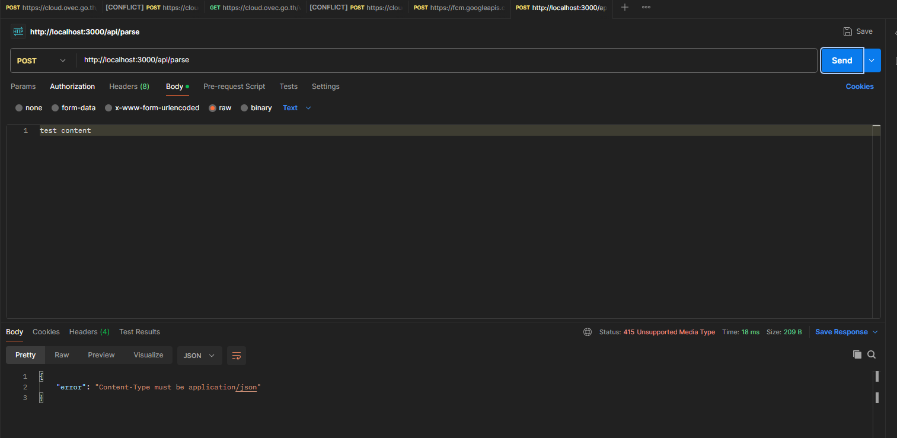
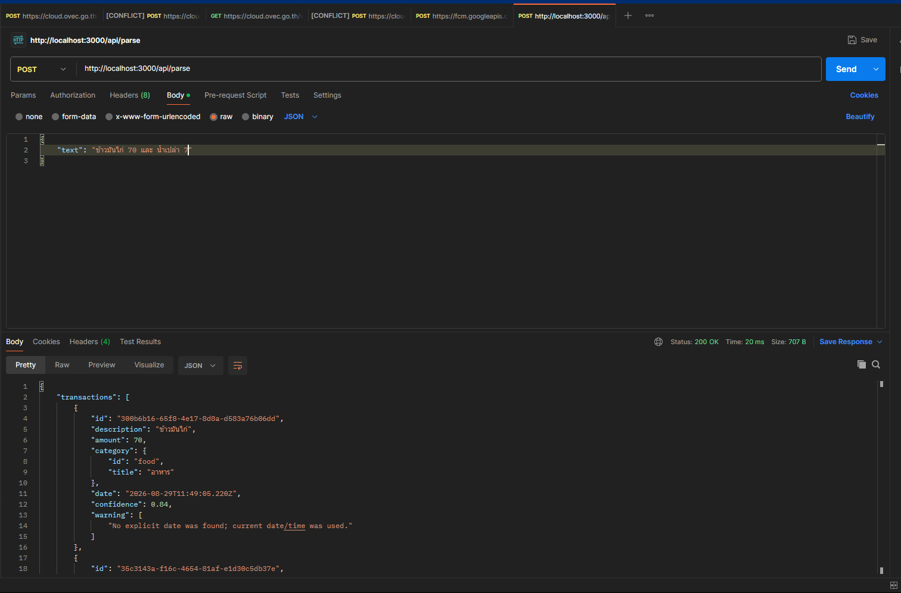

# Assignment 2 — Text → Transaction Flow (Parnuan Take-Home)
เพื่อไม่ให้เสียเวลาโดยไม่จำเป็นผมจะใช้ code base เดิมจาก Assignment 1 เลย แต่ผมจะหยิบ Docker มาใช้ด้วยใน การทำ docker-compose database และ ทำให้พี่ๆ ตรวจ งานของผมได้ง่ายขึ้นเพราะบางทีพี่อาจจะใช้ Mac ไม่ก็ linux ทำให้ environment บางอย่างของเราอาจเกิดข้อผิดพลาดได้

