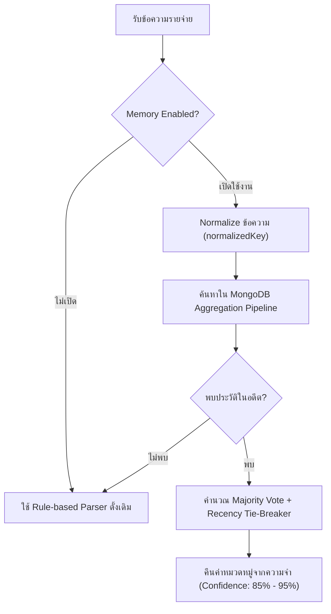

# Assignment 2 — Parnuan Memory Engine (Take-Home Submission)

ระบบ Memory Layer สำหรับจดจำพฤติกรรมและจัดหมวดหมู่รายจ่ายอัตโนมัติตามประวัติการใช้งานจริงของผู้ใช้แต่ละบุคคล (Personalized Expense Memory Engine) สร้างขึ้นครอบทับ Parser จาก Assignment 1

---

## สารบัญ (Table of Contents)
1. [Reverse-Engineered Behavior (พฤติกรรมที่วิเคราะห์ได้จากภาพโจทย์)](#1-reverse-engineered-behavior)
2. [Assumptions (สมมติฐานและการออกแบบ)](#2-assumptions)
3. [Memory Data Model (โครงสร้างข้อมูลความจำ)](#3-memory-data-model)
4. [Matching Strategy (กลยุทธ์การจับคู่ความจำ)](#4-matching-strategy)
5. [Update & Sync Rules (กฎการซิงค์และอัปเดตความจำ)](#5-update--sync-rules)
6. [Trust & Transparency (ความโปร่งใสและการควบคุมของผู้ใช้)](#6-trust--transparency)
7. [Trade-offs (การประเมินข้อดีข้อเสียทางสถาปัตยกรรม)](#7-trade-offs)
8. [Edge Cases & 3 Realistic Failure Modes (กรณีขอบและข้อจำกัด)](#8-edge-cases--failure-modes)
9. [Future Improvements (แผนการพัฒนาต่อยอด)](#9-future-improvements)
10. [Setup Instructions & Time Spent (การติดตั้ง ทดสอบ และเวลาที่ใช้)](#10-setup--time-spent)

---

## 1. Reverse-Engineered Behavior

จากการวิเคราะห์พฤติกรรมของระบบจากภาพ Screenshots ในโจทย์ สรุปพฤติกรรมหลักได้ดังนี้:

* **Passive Learning from Transactions:** ระบบไม่ได้ให้ผู้ใช้มานั่งสอนกฎทีละข้อ (Explicit Rule Teaching) แต่เรียนรู้จากพฤติกรรมจริงในอดีตของผู้ใช้ผ่านทุกรายการที่กดยืนยันบันทึก (Confirmed Transactions)
* **Per-User Memory Isolation:** ความจำถูกแยกขาดออกจากกันตามรายผู้ใช้ (`userId`) พฤติกรรมของ "นัท" จะไม่ส่งผลต่อการจัดหมวดหมู่ของ "เติ้ล"
* **Real-time Synchronization on Edit:** เมื่อผู้ใช้แก้ไขหมวดหมู่ของรายการในอดีต (เช่น เปลี่ยน `ข้าวมันไก่` จาก `อาหาร` เป็น `ข้าวเช้า`) ความจำของระบบจะอัปเดตตามทันที และมีข้อความแจ้งเตือน "อัปเดตความจำแล้ว"
* **User Control (Settings Toggle):** มีสวิตช์เปิด/ปิด "จัดหมวดด้วยความจำ" แยกรายบุคคล เมื่อปิดใช้งาน ระบบจะถอยกลับไปใช้ Parser เริ่มต้น และเมื่อเปิดใหม่ ความจำจะยังคงถูกต้องสอดคล้องกับประวัติทั้งหมด

---

## 2. Assumptions

1. **Memory Keying & Normalization:** ระบบใช้ Normalized Description เป็นคีย์หลักในการค้นหาความจำ โดยตัดช่องว่างหัวท้าย แปลงตัวอักษรละตินเป็นตัวพิมพ์เล็ก และยุบช่องว่างซ้ำซ้อน (`  ข้าวมันไก่   พิเศษ  ` -> `ข้าวมันไก่ พิเศษ`)
2. **Dynamic Categories & Custom Naming:** ผู้ใช้แต่ละคนมีโครงสร้างหมวดหมู่ไม่เหมือนกัน (เช่น บางคนใช้ `อาหาร`, บางคนแยกเป็น `ข้าวเช้า`, `ข้าวเที่ยง`, `ข้าวเย็น` หรือสร้างหมวด `อาหารแมว`) ระบบจึงรองรับทั้ง Preset มาตรฐาน และ Custom Category ที่ผู้ใช้พิมพ์เอง
3. **Threshold for Override:** เมื่อมีประวัติที่ตรงกันอย่างน้อย 1 รายการ ระบบจะดึงความจำมาแสดงเป็นค่าเริ่มต้น พร้อมแสดงระดับความมั่นใจ (Confidence Score) และป้าย `[จัดหมวดจากความจำ]` ให้ผู้ใช้ตรวจสอบก่อนยืนยัน
4. **Scope of Edit:** การแก้ไขหมวดหมู่ของธุรกรรม 1 รายการ จะถูกบันทึกเป็นหลักฐานใหม่ในประวัติ และคำนวณน้ำหนักร่วมกับรายการอื่นในอดีตผ่าน Majority Voting & Recency Rule

---

## 3. Memory Data Model

### สถาปัตยกรรมแบบ Derived View vs Materialized Store

ระบบนี้เลือกใช้สถาปัตยกรรม **Dynamic Derived View บน MongoDB Aggregation Pipeline** โดย**ไม่มีการสร้างตาราง `memories` แยกต่างหาก**

```
+-------------------------------------------------------------+
|                MongoDB: transactions collection             |
|   { userId, normalizedKey, categoryId, categoryTitle, ... } |
+-------------------------------------------------------------+
                              │
               (Dynamic Aggregation on Demand)
                              ▼
+-------------------------------------------------------------+
|                  Derived Memory Resolution                  |
|    $match -> $group (Majority Count) -> $sort (Recency)     |
+-------------------------------------------------------------+
```

### เหตุผลทางวิศวกรรม:
* **Single Source of Truth:** เมื่อประวัติธุรกรรมถูกแก้ไขหรือลบ ความจำจะเปลี่ยนแปลงตามทันที 100% โดยไม่มีปัญหา Data Drift หรือปัญหาความจำค้าง (Stale Memory)
* **Zero Synchronization Lag:** ไม่ต้องเขียน Background Job หรือ Trigger คอยซิงค์ข้อมูลระหว่าง 2 ตาราง

### MongoDB Schemas:

#### Collection: `transactions`
```typescript
interface TransactionDocument {
  id: string;              // UUID ประจำรายการ
  userId: string;          // รหัสผู้ใช้งาน (เช่น user_nut, user_title)
  description: string;     // ข้อความรายการต้นฉบับ
  normalizedKey: string;   // ข้อความที่ทำ Normalization สำหรับจับคู่
  amount: number;          // จำนวนเงิน
  categoryId: string;      // รหัสหมวดหมู่ (เช่น food, breakfast, custom_cat)
  categoryTitle: string;   // ชื่อหมวดหมู่ภาษาไทย (เช่น ข้าวเช้า, ช้อปปิ้ง)
  date: Date;              // วันที่ของธุรกรรม
  createdAt: Date;         // เวลาที่บันทึกเข้าระบบ
  updatedAt: Date;         // เวลาที่แก้ไขล่าสุด
}
```

#### Collection: `user_settings`
```typescript
interface UserSettingsDocument {
  userId: string;          // รหัสผู้ใช้งาน
  memoryEnabled: boolean;  // สถานะเปิด/ปิดโหมดจัดหมวดด้วยความจำ
  updatedAt: Date;
}
```

#### Collection: `users`
```typescript
interface UserDocument {
  id: string;              // user_nut, user_title
  name: string;            // นัท, เติ้ลแฟนนัท
  avatar: string;          // URL รูปภาพโปรไฟล์
  createdAt: Date;
}
```

---

## 4. Matching Strategy

เมื่อมีข้อความรายจ่ายเข้ามา ระบบจะดำเนินการตามลำดับขั้น:



### การคำนวณคะแนนความมั่นใจ (Confidence Heuristic):
* **ความถี่ 1 ครั้ง:** ความมั่นใจ 85% (`confidence = 0.85`)
* **ความถี่ 2 ครั้งขึ้นไปและเป็นเอกฉันท์:** ความมั่นใจ 95% (`confidence = 0.95`)
* **มีประวัติขัดแย้งกัน (เช่น อาหาร 2 ครั้ง, ข้าวเช้า 1 ครั้ง):** คำนวณตามสัดส่วน `ratio = count / total` ปรับสเกลให้อยู่ในช่วง 0.70 - 0.90

---

## 5. Update & Sync Rules

### กฎการแก้ความขัดแย้ง (Conflict Resolution):
1. **Majority Rule:** หมวดหมู่ที่มีจำนวนครั้งการบันทึกมากที่สุดจะได้รับเลือกเป็นอันดับแรก
2. **Recency Tie-Breaker:** หากจำนวนครั้งเท่ากัน (เช่น บันทึก `อาหาร` 1 ครั้ง และ `ข้าวเช้า` 1 ครั้ง) ระบบจะเลือกหมวดหมู่ของรายการที่มี `updatedAt` / `createdAt` ใหม่ล่าสุด
3. **Instant Deletion Handling:** หากรายการถูกลบออกจาก `transactions` การคำนวณ Aggregation ครั้งถัดไปจะตัดรายการนั้นออกทันทีโดยอัตโนมัติ

---

## 6. Trust & Transparency

* **Inspectable Memory State:** ผู้ใช้สามารถดูรายการคำศัพท์ทั้งหมดที่ระบบเรียนรู้ได้ผ่าน Sidebar บนหน้าเว็บ หรือผ่าน API `GET /api/memory?userId=...` โดยแสดงทั้งจำนวนครั้งที่ใช้ และคะแนนความมั่นใจ
* **Memory Deletion & Resetting:** ผู้ใช้สามารถควบคุมข้อมูลความจำของตนเองได้เต็มรูปแบบ:
  * **ลบเฉพาะคำ:** กดปุ่มถังขยะ `🗑️` ที่การ์ดคำศัพท์ หรือเรียก `DELETE /api/memory?userId=...&keyword=...`
  * **ล้างความจำทั้งหมด:** กดปุ่ม `ล้างทั้งหมด` หรือเรียก `POST /api/memory/clear`
* **Clear Attribution Badge:** ในหน้าตรวจสอบก่อนบันทึก ระบบจะแสดงป้าย `🧠 [จัดหมวดจากความจำ]` หรือ `⚙️ [จัดหมวดโดยระบบ]` ชัดเจน พร้อมเปอร์เซ็นต์ความมั่นใจ
* **Manual Override & Customization:** ผู้ใช้สามารถเปลี่ยนหมวดหมู่ผ่าน Dropdown หรือพิมพ์หมวดหมู่ใหม่ได้ทันทีก่อนกดยืนยัน

---

## 7. Trade-offs

| การตัดสินใจ | สิ่งที่เลือก | ข้อดี | ข้อเสีย / ข้อจำกัดที่ยอมรับ |
|---|---|---|---|
| **Data Architecture** | Derived on Read (Aggregation) | ข้อมูล Consistent 100%, แก้ไข/ลบแล้วซิงค์ทันที ไม่เกิด Stale Memory | ต้องคำนวณ Query เมื่อเรียกใช้งาน (แก้ไขได้ด้วย Index `{ userId: 1, normalizedKey: 1 }`) |
| **Matching Engine** | Normalized Exact Match | แม่นยำสูง (High Precision), ไม่เดาสุ่มจนผิดพลาด, ทำงานเร็วมาก (< 5ms) | ไม่รองรับคำพ้องความหมายที่สะกดต่างกันสิ้นเชิง (Semantic Synonyms) |
| **Technology Stack** | Native MongoDB Driver + Bun | Native ESM, ปลอดภัยจาก ORM overhead, รองรับ Aggregation Pipeline ประสิทธิภาพสูง | ต้องจัดการ Polyfill สำหรับบาง Driver บน Runtime ใหม่ |

---

## 8. Edge Cases & Failure Modes

### Edge Cases ที่รองรับและผ่านการทดสอบ:
* **Cold Start:** ผู้ใช้ใหม่ที่ยังไม่มีประวัติ ระบบจะ Fallback กลับไปใช้ Parser เริ่มต้นอย่างราบรื่น
* **Multi-user Isolation:** ผู้ใช้ 2 คนใช้คำเดียวกันแต่เลือกคนละหมวดหมู่ ระบบแยกผลลัพธ์เด็ดขาด
* **Whitespace & Case Variations:** `  ข้าวมันไก่  ` และ `ข้าวมันไก่` หรือ `Grab` และ `grab` ถูก Normalize ให้เป็นคีย์เดียวกัน
* **Category Override in History:** การแก้ไขรายการในอดีตทำให้ความจำอนาคตเปลี่ยนตามทันที

### 3 Realistic Failure Modes (ข้อจำกัดในปัจจุบัน):
1. **Semantic Synonyms without Lexical Overlap:** หากระบบเคยจำ `ข้าวมันไก่` -> `อาหาร` แต่ผู้ใช้พิมพ์ `ข้าวมันไก่ตอน` หรือ `ไก่ตอนพิเศษ` ตัว Matching แบบ Lexical จะถือว่าเป็นคนละคีย์และ Fallback ไปที่ Parser
2. **Context-Dependent Transactions:** คำเดียวกันในเวลาต่างกัน (เช่น `ข้าวมันไก่` ตอน 08:00 ควรเป็น `ข้าวเช้า` แต่ตอน 19:00 ควรเป็น `ข้าวเย็น`) ระบบปัจจุบันยังเลือกตาม Majority รวม ไม่ได้แยกเงื่อนไขตามช่วงเวลา
3. **Typo / Misspelling:** หากผู้ใช้พิมพ์ผิด เช่น `ข้าวมันไก่่` (มีวรรณยุกต์ซ้อน) จะไม่ตรงกับคีย์ `ข้าวมันไก่` เดิม

---

## 9. Future Improvements

หากมีเวลาพัฒนาเพิ่มเติมในอนาคต:
1. **Hybrid Lexical + Vector Embedding Search:** ใช้ Embedding โมเดลขนาดเล็ก (เช่น Sentence-Transformers) เพื่อจับคู่คำที่มีความหมายใกล้เคียงกัน (เช่น `มื้อเช้า` กับ `ข้าวเช้า`)
2. **Time-decay & Temporal Context Weighting:** เพิ่มค่าน้ำหนักตามช่วงเวลาของวัน (Time of Day) และลดน้ำหนักของประวัติที่เก่ามาก (Time Decay)
3. **N-gram Compound Extraction:** ตัดคำและดึงคำหลัก (Keywords) ออกจากประโยคยาวเพื่อจับคู่ความจำเฉพาะจุด

---

## 10. Setup Instructions & Time Spent

### สิ่งที่ต้องมีก่อนติดตั้ง (Prerequisites):
* [Bun](https://bun.sh) (v1.2+)
* [Docker](https://www.docker.com/) & Docker Compose (สำหรับรัน MongoDB)

### ขั้นตอนการรันระบบ:

```bash
# ติดตั้ง Dependencies
bun install

# เริ่มต้นฐานข้อมูล MongoDB ผ่าน Docker Compose
docker compose up -d

# รันระบบ Development Server
bun dev
```
เปิดเบราว์เซอร์ไปที่: `http://localhost:3000`

### การรันชุดทดสอบ (Automated Unit Tests):
```bash
bun test
```
*ครอบคลุม 49 เทสต์ 115 assertions ครบทั้ง Candidate, Category, Date, Transaction และ Memory Layers*

---

### เวลาที่ใช้ในการพัฒนา (Time Spent)
* **การออกแบบ Architecture & Memory Layer Data Model:** 45 นาที
* **การพัฒนา Memory Service & Aggregation Pipeline:** 1 ชั่วโมง 15 นาที
* **การเขียน Unit Tests ครอบคลุม 3 Demo Flows:** 45 นาที
* **การปรับปรุง UI/UX (2-Column Sidebar, HTMX OOB Swaps, Custom Categories):** 1 ชั่วโมง
* **การจัดทำ Documentation & Technical Design:** 45 นาที
* **รวมเวลาทั้งหมด:** ประมาณ 4 ชั่วโมง 30 นาที
